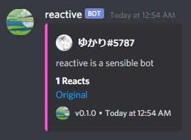

# reactive

Like Starboard, but simpler.

## Features

* Set a single board in your server where messages reaching some number of reacts
  are forwarded.
* Choose how many reactions are required before something reaches the board.
* Attachments are included.
* Links to the original post.

## Behavior

* Reactions on bot posts are ignored.
* Posts fall off the board when they fall below the threshold.
* The reaction count of each post on the board is updated automatically.

## Commands

All commands for reactive are prefixed by `..`. If you are hosting it yourself,
you can change the prefix in `src/index.js`.

Command Name | Argument(s) | Description
-|-|-
`setMin` | `Number` | Set the minimum number of reactions required to reach the board.
`setChan` | `TextChannel` | Sets the channel to repost to.

## Adding to Your Server

In its current state, reactive can only be self-hosted.

If you're hosting the bot yourself, you need:
* [MongoDB cluster](https://www.mongodb.com/blog/post/quick-start-nodejs-mongodb--how-to-get-connected-to-your-database)
* [Discord bot token](https://discordpy.readthedocs.io/en/latest/discord.html).

Once both of these have been created, you'll need to set bot parameters in
`.env`. Check `.env.example` for some example parameters.
